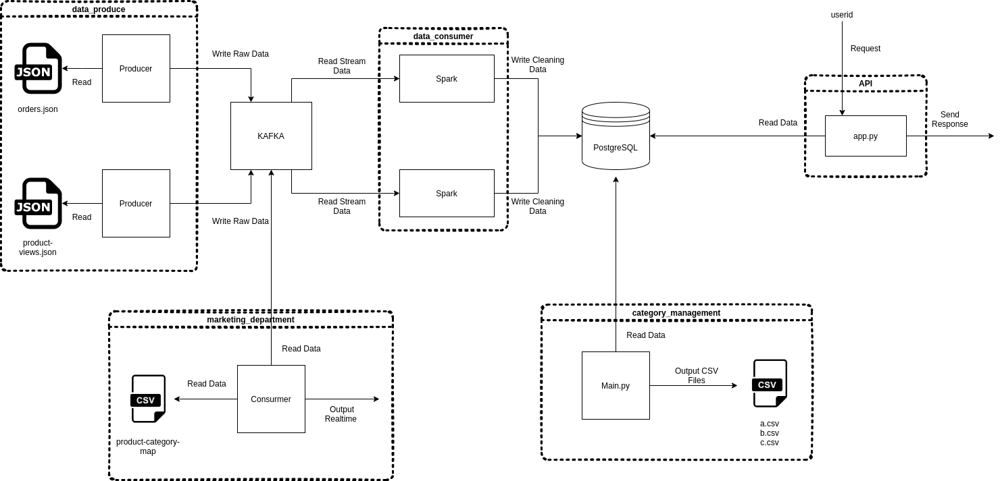
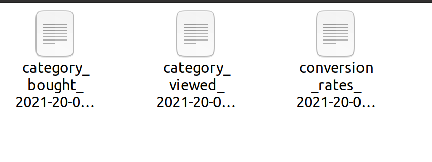
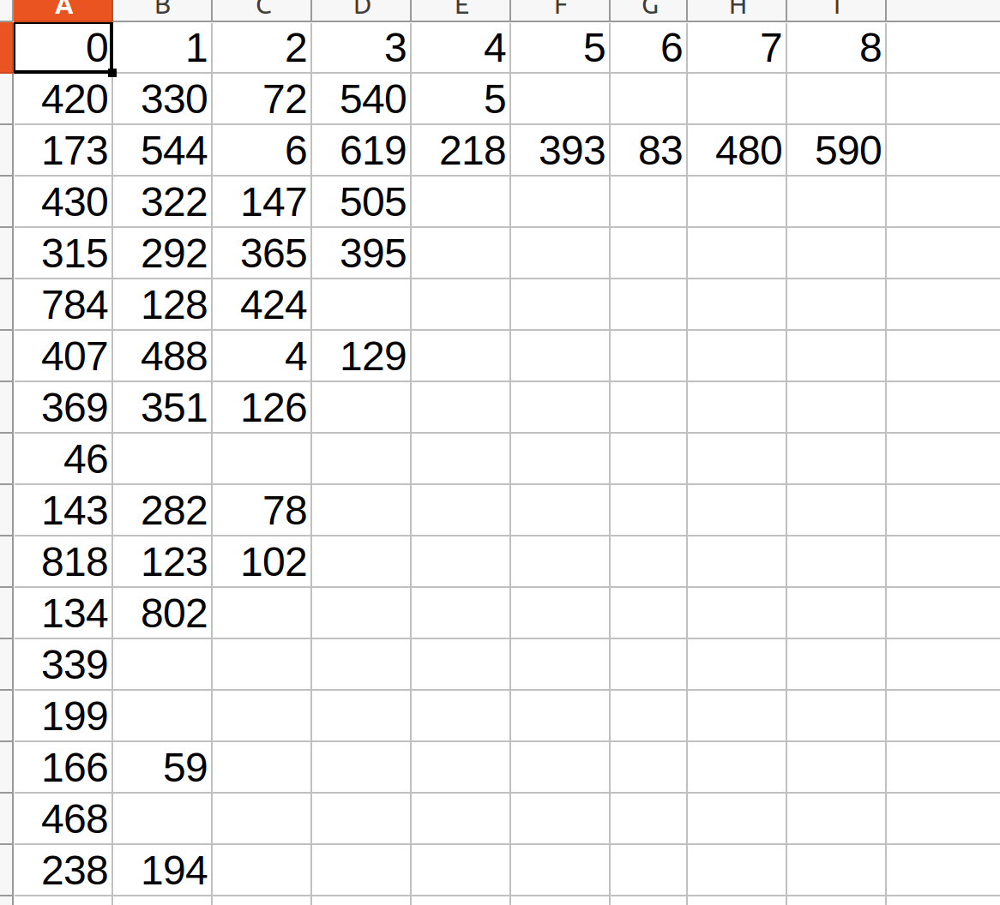
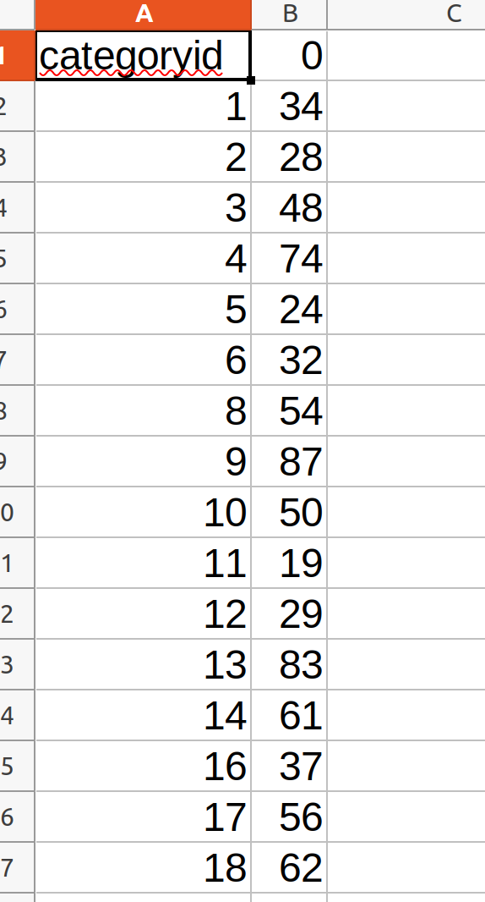
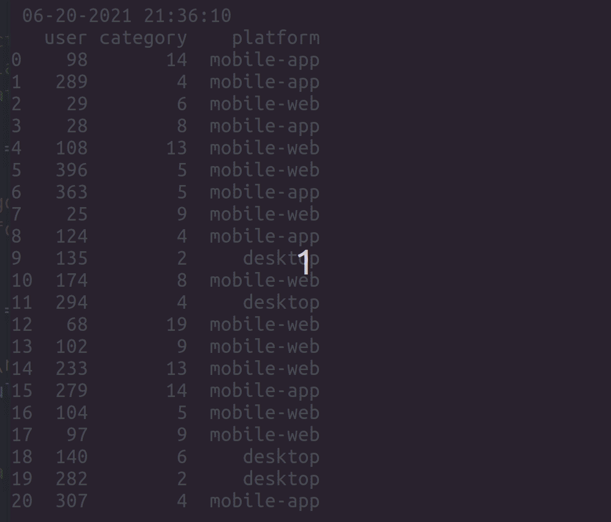
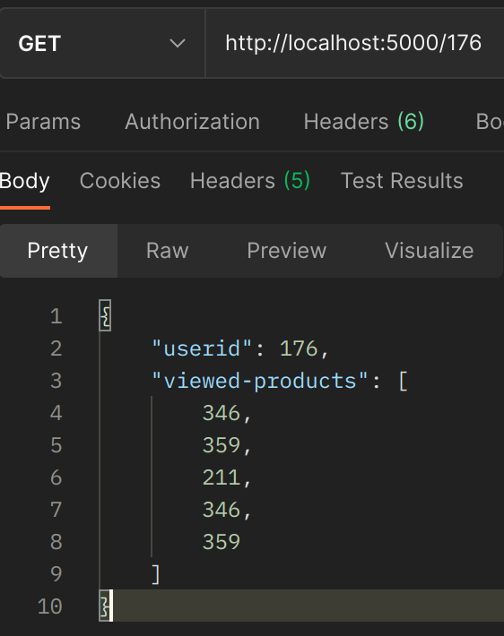

## Hepsiburada Case

Hepsiburada' nın atmış olduğu case kodları.

Bana gönderdikleri verileri kullanarak benden istedikleri şeyler;

* Kategori yönetiminin saatlik olarak belirli dosya formatında istediği veriler
    * Herbir ürün kategorisi için farklı kullanıcılar tarafından en fazla görüntülenen 10 ürün.
    * Herbir ürün kategorisi için farklı kullanıcılar tarafından en fazla satın alınan 10 ürün.
    * Her bir ürün kategorisi için (satın alma / görüntülenme) sayısı

* Pazarlama departmanı için gerçek zamanlı analizler
    * Son 5 dakika içinde ürün görüntüleyen kullanıcılar
    * Son 5 dakika içinde ürün görüntülenen kategoriler
    * Son 5 dakika içinde ürün görüntülenen platformlar

* Kullanıcılara ürün tavsiye etmek için id numarasi verilen kullanıcının incelediği 5 ürünü dönen bir API

## İçindekiler

* [Kullanılan Teknolojiler](#kullanılan-teknolojiler)
* [Çalışma Sistemi](#çalışma-sistemi)
    * [Modüller ve yaptığı işler](#modüller-ve-yaptığı-işler)
* [İstenen Çıktılar](#i̇stenen-çıktılar)
    * [Requirenment-1: category_management](#requirenment-1-category_management)
    * [Requirenment-2: marketing_department](#requirenment-2-marketing_department)
    * [Requirenment-3: api](#requirenment-3-api)
* [Eksikler ve Hatalar](#eksikler-ve-hatalar)

## Kullanılan Teknolojiler

Teknoloji   | Kullanımı
---------   | ---------
Linux       | Sistem Linux üzerinde kurulmuştur. Ubuntu dağıtımı
Kafka       | Sistemler için ortak veri platformu
PostgreSQL  | Temizlenen verilerin yazıldığı DB.
Docker      | Kafka ve PostgreSQL
Python3.8   | Sistemin yazıldığı dil
Spark       | Kafka' dan veriyi okuyup, temizleyip DB' ye yazmak için
Flask       | API yazabilmek için
SQLAlchemy  | API için veritabanı sorgularını daha kolay yapmak için kullanıldı
Pandas      | CSV dosyalarını oluşturmak için

>**Reponun root dizinindeki config.yml dosyasında `Kafka`, `PostgreSQL` bağlantı bilgilerini girebilirsiniz**

## Çalışma Sistemi

### Modüller ve yaptığı işler

Kurulum ve daha fazla bilgi için modüllere tıklayınız. **Modülleri kendi dizinlerinden çalıştırın.**

Modül | Yaptığı iş
----- | ----------
[data_produce](code/data_produce)                   | Gönderilen data dosyalarını Kafka' ya yazar.
[data_consumer](code/data_consumer)                 | Kafka' dan veri okur ve PostgreSQL' e yazar
[category_management](code/category_management)     | DB' den verileri okuyarak kategori yönetimi için istenen csv dosyalarını elde eder.
[marketing_department](code/marketing_department)   | Pazarlama departmanının talep ettiği gerçek zamanlı analizler gerçekleştirir
[api](code/api)                                     | Kullanıcılara ürün tavsiye etmek için belirli kullanıcının incelediği 5 ürünü döner

## İstenen Çıktılar

## Requirenment-1: category_management

Bu işlemleri saatlik olarak gerçekleştirmek için AirFlow kullanılabilir.

Yazdığım sorgular ile ilgili bilgi almak [için](code/category_management#sorgu-mantiğı)

### A

### B

### C

## Requirenment-2: marketing_department

## Requirenment-3: api

