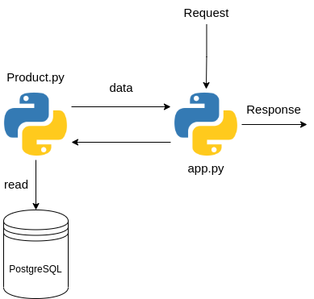

## API

Bu modül kendine verilen kullanıcın görüntülediği en son 5 ürünü dönen bir API' dır.


## İçindekiler

* [Nasıl Kurulur](#nasıl-kurulur)
* [Çalışma Sistemi](#calisma-sistemi)
* [Nasıl Çalıştırılır](#nasıl-çalıştırılır)
* [Eksikler ve Hatalar](#eksikler-ve-hatalar)

### Nasıl kurulur?

Sistemin çalışması için gerekli `python` kütüphanelerini ise aşağıdaki komutla kurabilirsiniz;

```
pip3 install -r requirements.txt
```

### Calisma Sistemi



`Product.py` bir `SQLAlchemy` model' idir.

Sistemde api için `Flask` kullanılmıştır.


### Nasıl çalıştırılır?

```
python3 app.py
```


### Eksikler ve Hatalar
