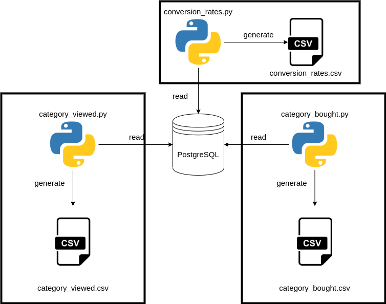

## Category Management

Bu modül `PostgreSQL`' e yazılan verileri kullanılarak aşağıdaki işlemleri gerçekleştirir;
1. Her bir kategori için, farklı kullanıcıların en fazla görüntülediği 10 ürünü
2. Her bir kategori için, farklı kullanıcıların en fazla satın aldığı 10 ürünü
3. Her bir kategori için (satın alınan / görünlenen) ürün oranı


## İçindekiler

* [Nasıl Kurulur](#nasıl-kurulur)
* [Çalışma Sistemi](#calisma-sistemi)
* [Nasıl Çalıştırılır](#nasıl-çalıştırılır)
* [Eksikler ve Hatalar](#eksikler-ve-hatalar)

### Nasıl kurulur?

Sistem veritabanı sorguları için `psycopg2` modülü kullanmaktadır. Bu modülü linux ortamında kullanmak için `libpq-dev`' i kurmamız gerekir.

```
sudo apt-get install libpq-dev
```

Sistemin çalışması için gerekli `python` kütüphanelerini ise aşağıdaki komutla kurabilirsiniz;

```
pip3 install -r requirements.txt
```

Sistemin düzgün çalışabilmesi için `product-category-map.csv` dosyasını `PostgreSQL`' e yazmamız gerekmektedir. Bu işlem için sisteminizde `Spark` olmalı. CSV dosyasını `PostgreSQL`' e yazmak için;
```
curl https://jdbc.postgresql.org/download/postgresql-42.2.5.jar --output postgresql-42.2.5.jar
python3 src/utils/write_csv_to_postgre.py 
```

### Sorgu Mantiğı

**Her bir kategori için, farklı kullanıcıların en fazla görüntülediği ve satın alıdığı 10 ürünü**

Bir kullanıcı aynı ürüne birden fazla bakabilir. Farklı kullanıcıların baktığı ürünleri elde etmek için join ile categoryid' yi elde ettiğim verileri categoryid, userid, productid' ye göre group by yaptım. Bu sayede aynı kullanıcıların baktığı aynı ürünleri listeden çıkarmış oldum.

Daha sonra elde edilen sorguyu bir tablo gibi kullandım ve bu seferde categoryid ve productid' ye groupladım ve userid' yi count ettim. Bu sayede herbir category' ide görüntülenen ya da satın alınan ürünleri bulmuş oldum.

<details>
<summary>Sorgu</summary>

```sql
SELECT
	categoryid,
	productid
FROM
	(
	SELECT
		ROW_NUMBER() OVER (PARTITION BY distinc_user.categoryid
	ORDER BY
		count(distinc_user.userid)) AS rownum,
		distinc_user.categoryid,
		distinc_user.productid,
		count(distinc_user.userid)
	FROM
		(
		SELECT
			op.categoryid,
			table_alias.userid,
			table_alias.productid
		FROM
			product_view table_alias,
			order_product op
		WHERE
			table_alias.productid = op.productid
		GROUP BY
			op.categoryid,
			table_alias.userid,
			table_alias.productid
		ORDER BY
			op.categoryid,
			table_alias.userid,
			table_alias.productid ) AS distinc_user
	GROUP BY
		distinc_user.categoryid,
		distinc_user.productid
	ORDER BY
		distinc_user.categoryid,
		count(distinc_user.userid) DESC ) tmp
WHERE
	rownum <= 10
ORDER BY
	categoryid,
	rownum;
```

</details>


**Her bir kategori için (satın alınan / görünlenen) ürün oranı**

Herbir kategoriye satın alınan ve görüntülenen ürünlerin sayısını veren ayrı ayrı sorgular yazdım.

Bu sorguları bir tablo gibi from ifadesinde kullandım ve categoryid üzerinden join' ledim sonra (o.order_count / v.view_count) ifadesi ile bu değerleri buldum.

<details>
<summary>Sorgu</summary>

```sql
SELECT
	o.categoryid,
	(o.order_count / v.view_count) AS "0"
FROM
	(
		SELECT
			op.categoryid,
			count(*) AS order_count
		FROM
			product_view pv,
			order_product op
		WHERE
			pv.productid = op.productid
		GROUP BY
			op.categoryid
		ORDER BY
			op.categoryid 
	) AS o,
	
	(
		SELECT
			op.categoryid,
			count(*) AS view_count
		FROM
			orders o,
			order_product op
		WHERE
			o.productid = op.productid
		GROUP BY
			op.categoryid
		ORDER BY
			op.categoryid 
	) AS v
WHERE
	o.categoryid = v.categoryid;
```

</details>

### Calisma Sistemi



Script' ler için gerekli olan sorgular `sql.py` dosyasından elde edelir.

Veritabanı bağlantısı `conn.py`' dan elde edilir.

Veritabanı bağlantısı için gereken şeyler `config.py` ile elde edilir.

Aşağıda klasör yapısını görebilirsiniz.

```bash
.
├── main.py
├── README.md
├── requirements.txt
└── src
    ├── category_bought.py
    ├── category_viewed.py
    ├── conversion_rates.py
    └── utils
        ├── config.py
        ├── conn.py
        ├── sql.py
        └── write_csv_to_postgre.py

2 directories, 10 files
```

### Nasıl çalıştırılır?

```
python3 main.py
```


### Eksikler ve Hatalar

1. Kod yazılım kötü
