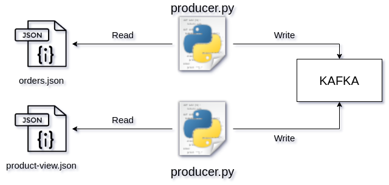

## Data Product

Bu sistem `ndjson` formatında verilmiş dosyaları, belirli sürede bir -mesela 5 saniyede bir- `Kafka`' ya yazmaya yarar. `Kafka`' ya yazılan veriler hiçbir temizleme işlemi olmadan olduğu gibi yazılmaktadır. 

## İçindekiler

* [Nasıl Kurulur](#nasıl-kurulur)
* [Çalışma Sistemi](#calisma-sistemi)
* [Nasıl Çalıştırılır](#nasıl-çalıştırılır)
* [Eksikler ve Hatalar](#eksikler-ve-hatalar)

### Nasıl kurulur?

Öncelikle sisteminizde `Kafka` kurulu olmalıdır. Bu sistem geliştirilirken `Kafka` kurulumu için `docker` kullanılmıştır. Kullanmış olduğum `docker-compose` dosyası aşağıdaki gibidir;

```yaml
version: '2'
services: 
    zookeeper:
        image: confluentinc/cp-zookeeper:latest
        environment: 
            ZOOKEEPER_CLIENT_PORT: 2181
    
    kafka:
        image: confluentinc/cp-kafka:latest
        depends_on: 
            - zookeeper
        ports: 
            - 9092:9092
        environment: 
            KAFKA_ZOOKEEPER_CONNECT: zookeeper:2181
            KAFKA_ADVERTISED_LISTENERS: PLAINTEXT://localhost:9092
            KAFKA_OFFSETS_TOPIC_REPLICATION_FACTOR: 1
    
    db:
        image: postgres
        depends_on: 
            - kafka
        environment:
            POSTGRES_PASSWORD: "123"
        ports:
            - 5432:5432
            
```

Sistemin çalışması için gerekli `python` kütüphanelerini ise aşağıdaki komutla kurabilirsiniz;

```
pip3 install -r requirements.txt
```

### Calisma Sistemi



Yukarıdaki resimde de görüldüğü gibi `producer.py` dosyası birden fazla kez çalıştırılarak belirli `json` dosyaları aynı anda belirli `Kafka` `topic`' lerine yazılır.


`producer.py` dosyası `ndjson` formatındaki verileri `ndjson.py` script' i sayesinde `list` formatında elde eder.

`producer.py`, `Kafka`' nın çalıştığı url' ı `config.yml` dosyasından `config.py` sayesinde elde eder.

`producer.py`, hangi `ndjson` dosyasını okuyacağını(--file), veriyi hangi `topic`' e yazacağını(--topic) ve verinin hangi sürede(--second) bir  `Kafka`' ya yazılacağını argümanlar ile elde eder.

Aşağıda klasör yapısını görebilirsiniz.

```bash
.
├── producer.py
├── README.md
├── requirements.txt
└── src
    ├── config.py
    ├── config.yml
    └── ndjson.py

1 directory, 6 files
```

### Nasıl çalıştırılır?

```
python3 producer.py --topic product --file data/product-views.json --second 1
```


### Eksikler ve Hatalar

1. Sistem sadece `ndjson` formatındaki verileri okuyup `Kafka`' ya yazıyor. Yeni bir format eklenmek istese sistemde değişiklik yapılmak zorundadır.
2. Unittest yok.