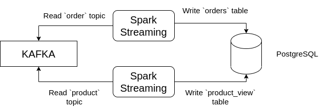

## Data Consumer

Bu sistem `Kafka`' daki belirli `topic` de bulunan veriyi `Spark streaming` ile `postgreSQL` veritabanına yazar.

### Kurulum

Öncelikle sisteminizde `Kafka` ve `Spark` kurulu olmalıdır. Daha sonra gerekli `python` kütüphaneleri için;

```
curl https://jdbc.postgresql.org/download/postgresql-42.2.5.jar --output postgresql-42.2.5.jar

pip3 install -r requirements.txt
```

### Calisma Mantığı



`consumer.py` kendisine verilen parametrelere göre `Kafka`' daki belirli `topic`' ı okur ve parametre olarak verilen `PostgreSQL`' deki tabloya yazar.


### Çalışma Örneği

```
spark-submit --packages org.apache.spark:spark-sql-kafka-0-10_2.12:3.1.2 --driver-class-path postgresql-42.2.5.jar consumer.py --topic order --table orders
```


### Kullanım

```
spark-submit --packages org.apache.spark:spark-sql-kafka-0-10_2.12:3.1.2 --driver-class-path postgresql-42.2.5.jar consumer.py --topic order --table orders

spark-submit --packages org.apache.spark:spark-sql-kafka-0-10_2.12:3.1.2 --driver-class-path postgresql-42.2.5.jar consumer.py --topic product --table product_view

```
